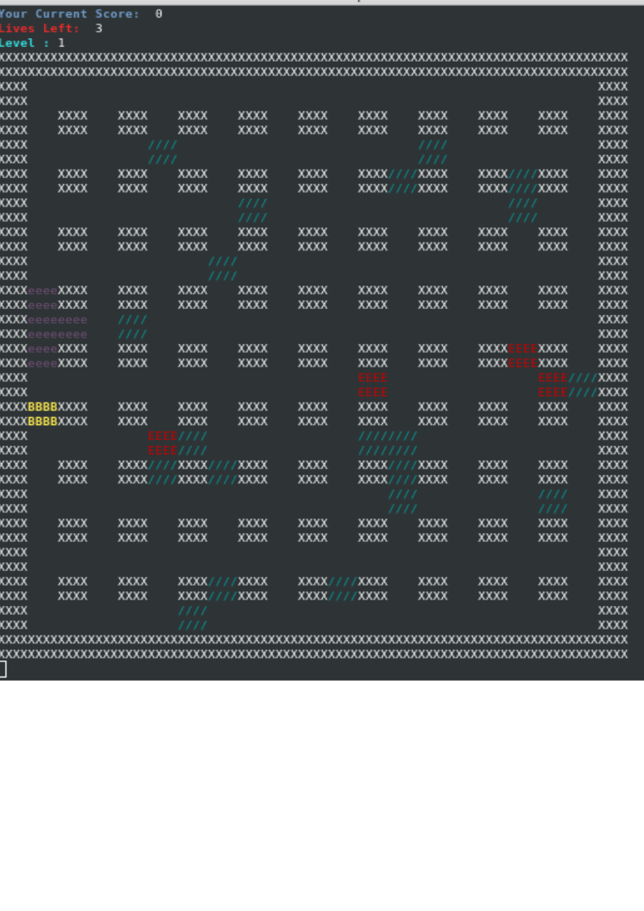

# Bomberman Game in Python

  Implementation of Bomberman game using OOP Principles in python language without use of any external library like pygame or curses.


## Features

* Coloured Terminal.
* The bomb displays the time left for explosion in seconds.
* Implementation of three Levels.
* Explosion display
* Score, Lives and Level display
* Random movement of enemies
* Explosion will not be displayed in part where enemy was present when it was killed.

## Rules of Play 

* 100 points will be rewarded for killing each enemy.
* 20 points will be rewarded for breaking each brick.
* Walls cannot explode while bricks can.
* Enemy can be killed by bomb.
* Bomberman can be killed by bomb or when it collides with enemy taking away one life.
* Kill all enemies to clear a particular level.
* Total of 3 lives are present.
* In each level number of enemies will be increased.	
* 3 levels are present. Complete all to win the game and share score with friends :)

## Prerequisites

Game works well on both python and python3. 

Things you need to install the software and instructions to install them:

* You should have python3 and pip3 installed:

First check if python3 is intstalled by using the command:

```
python3 -V
```

```
Output:
Python 3.5.3+
```

If not installed then type the following:

```
sudo apt-get update
sudo apt-get -y update
```

* Instructions for installing pip

```
sudo apt-get install python3-pip
```

* You should have termcolor installed.

If not then type the following:

```
sudo pip3 install termcolor
```
or 

```
sudo pip3 install requirements.txt
```


## Deployment

* Just run python3 main.py for starting the game on your terminal

## Controls

| Keys          | Movement      |
| ------------- |:-------------:|
| b             | Bomb Drop		|
| q 			| Quit Game 	|
| w             | Move Up       |
| a             | Move Left     |
| s             | Move Down     |
| d             | Move Right    |

## Display Icons

| Icon          | Significance    |    
| ------------- |:---------------:|
| B             | Bomberman		  |
| E 			| Enemy 		  |
| X             | Walls    		  |
| /             | Bricks	      |
| e             | Explosion       |
| [1 1]         | Bomb with Timer |    


## Screenshot



## Developer

* **Kanav Gupta (20161151)**